# Admin Dashboard Web Application (React.js)


---

## 📌 About The Project

A dynamic Admin Dashboard built using React.js that fetches and manages data from the DummyJSON REST API.

This project demonstrates:
- API integration
- Dynamic routing
- Authentication system
- Interactive UI with multiple modules

---

## Live Demo

[Open Live Dashboard](https://react-admin-dashboard-jadr9ydy5.vercel.app)

---

## 🚀 Key Features

- 🔐 Authentication system with Login and Logout
- 📊 Dashboard layout with sidebar navigation
- 📦 Products, Carts, Recipes, Users, Posts, Comments, and Todos modules
- 🔄 REST API integration using Axios
- 🔀 Dynamic routing using React Router
- 🔍 Search functionality for filtering data
- 📄 Detailed view pages for items
- 🛒 Cart management with quantity control
- 💰 Automatic total price calculation
- 📱 Responsive card-based UI

---

## 🛠 Built With

- React.js
- JavaScript
- Axios
- React Router
- HTML
- Tailwind CSS

---

## ⚙️ Getting Started

### Prerequisites

- Node.js
- npm

---

### Installation
```

1. Clone the repository
git clone https://github.com/krishnavekariya346-blip/admin-dashboard-react.git

2. Navigate to project folder
cd admin-dashboard-react

3. Install dependencies
npm install

4. Run the project
npm run dev

App will run at:
http://localhost:5173

```


---

## 💻 Usage

This dashboard allows users to explore and manage data from DummyJSON API.

Modules included:

- Products
- Carts
- Recipes
- Users
- Posts
- Comments
- Todos

Each module supports:
- Data fetching
- Search
- Detail view

---

## 📸 Screenshots

### 🔐 Login
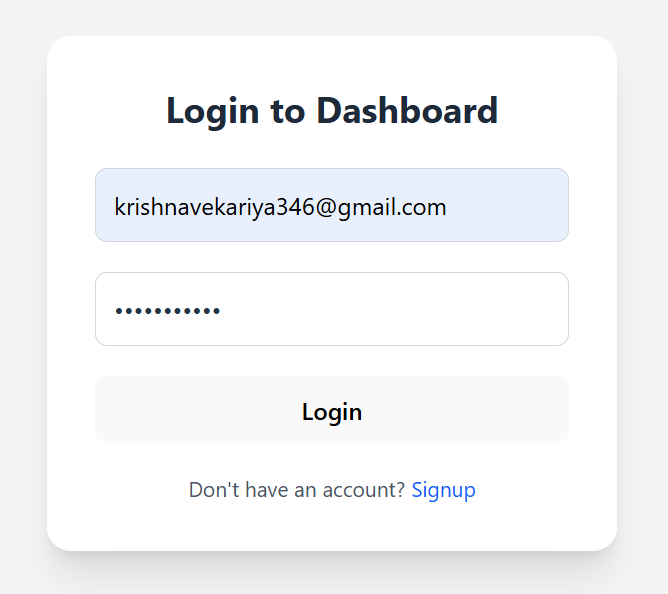

### 📝 Signup
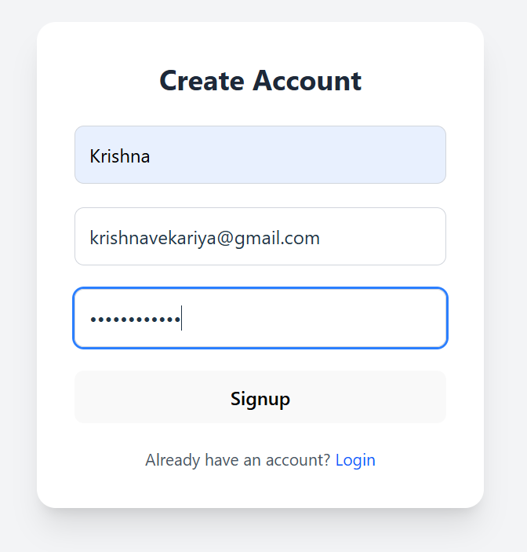

### 📊 Dashboard
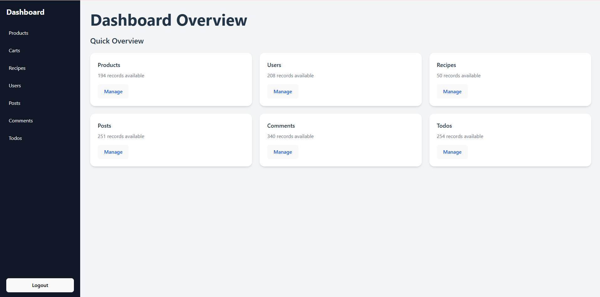

### 📦 Products
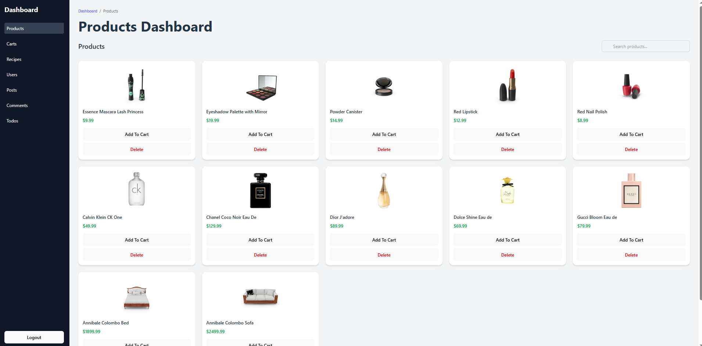

### 🛒 Cart
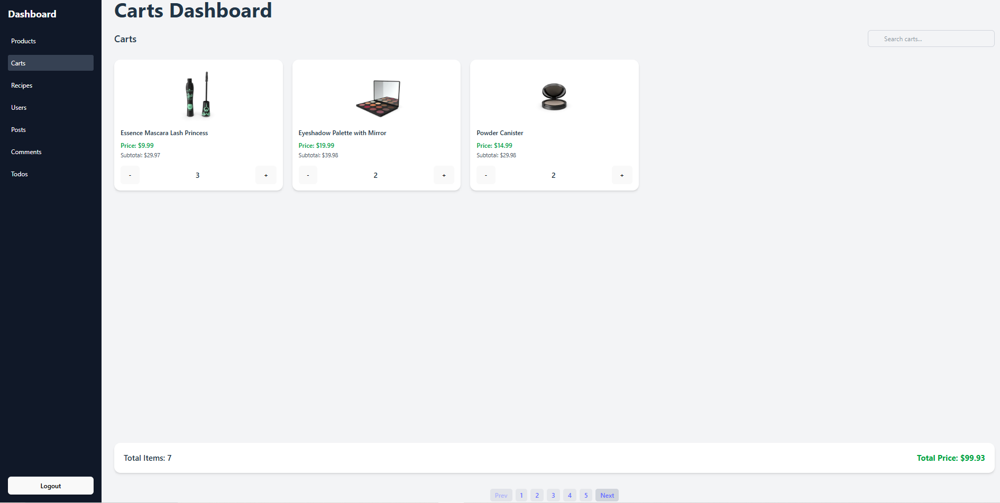

### 📰 Posts
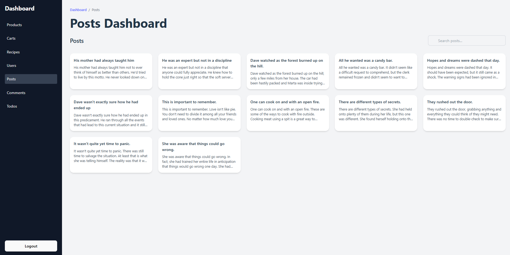

### 🍲 Recipes
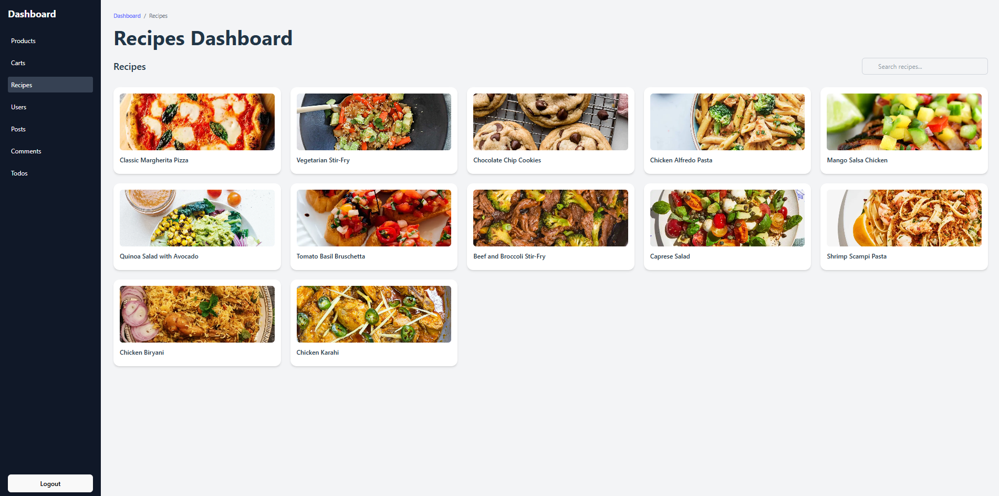
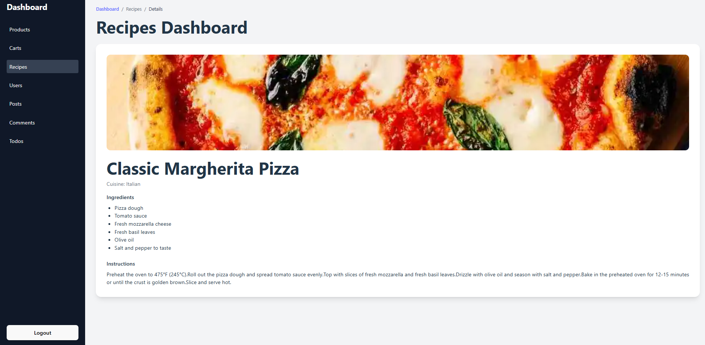

### 💬 Comments
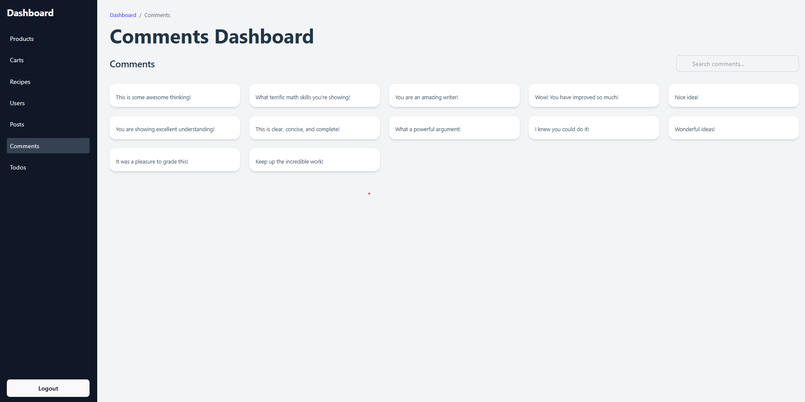

### 👤 Users
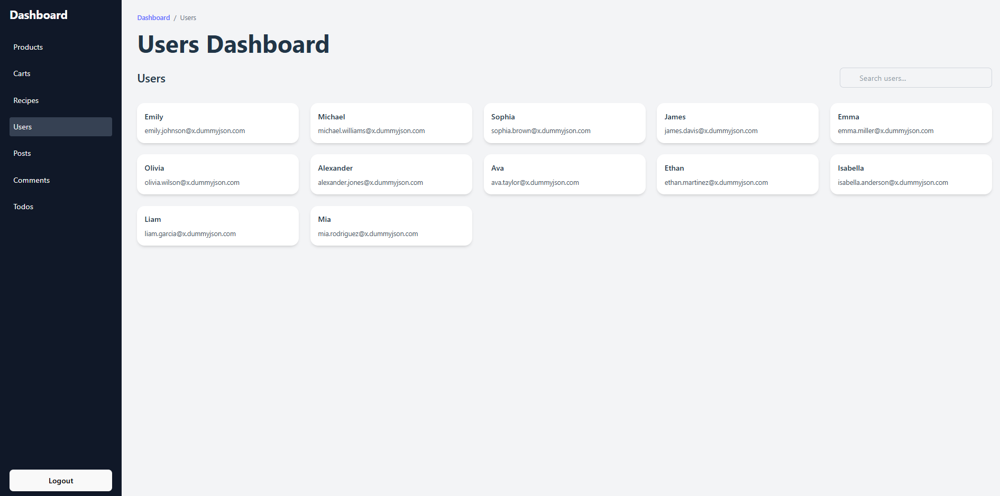

### ✅ Todos
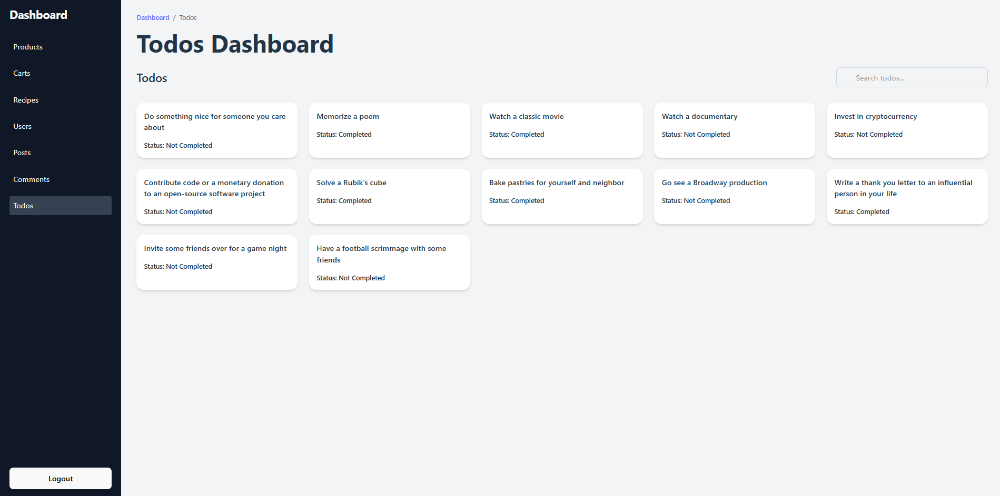
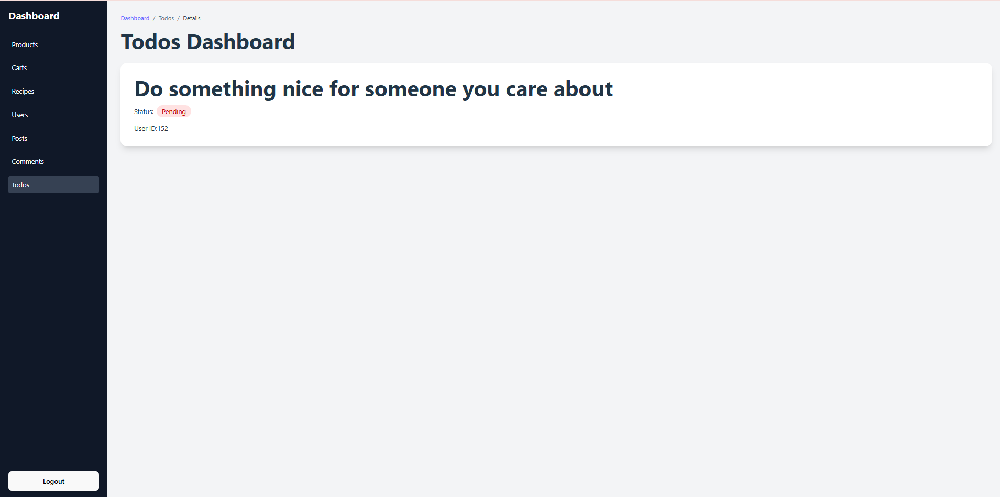

---

## 🌐 Live Demo

👉 https://react-admin-dashboard-jadr9ydy5.vercel.app

---

## 📬 Contact

**Krishna Vekariya**

GitHub:  
https://github.com/krishnavekariya346-blip/admin-dashboard-react

---

## 🙏 Acknowledgments

- DummyJSON API
- React Documentation
- Axios Documentation
- React Router Documentation


